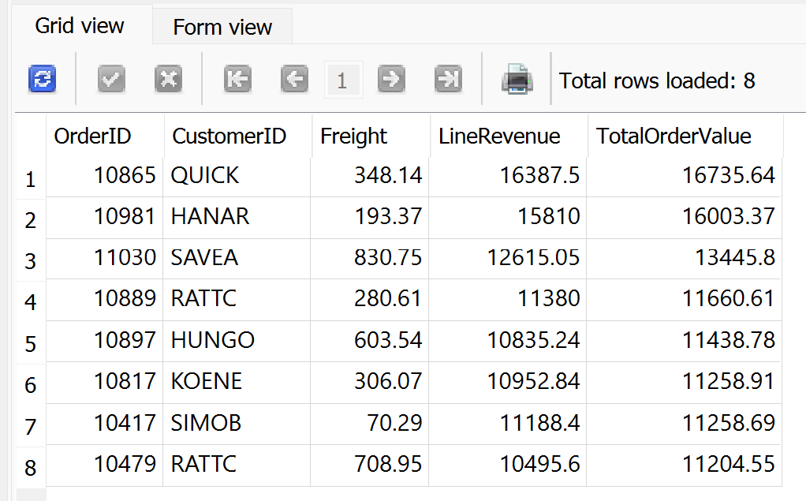
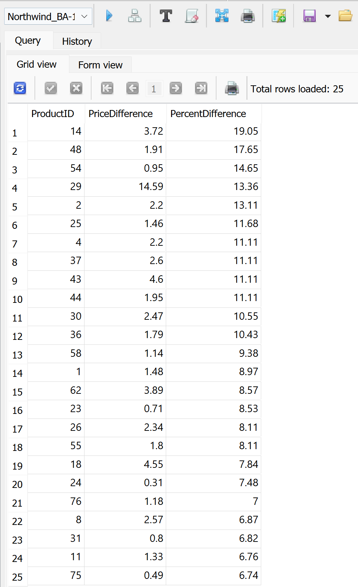
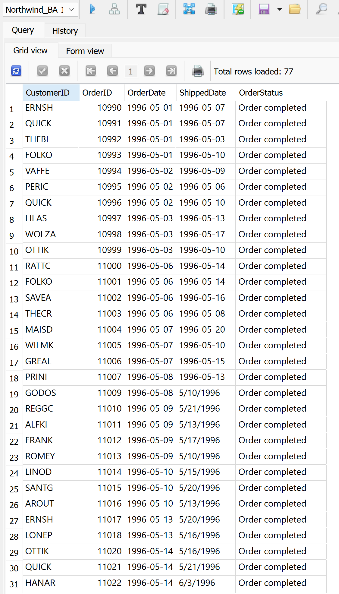
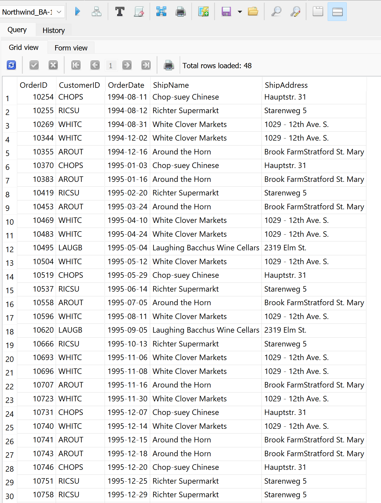

# Northwind SQL Business Analysis

Project Overview
    This project analyzes transactional sales data from the Northwind database using SQL. Rather than focusing on basic SELECT statements, the goal was to answer business-driven questions related to revenue performance, pricing impact, order fulfillment, and data integrity.

    All queries were written manually and structured to reflect real-world analytics workflows, including revenue calculations, aggregation, conditional logic, and data validation techniques.

Skills Demonstrated:
1. Filtering and wildcard searches
2. Subqueries and view creation
3. CASE statements and NULL handling
4. INNER JOIN and LEFT OUTER JOIN logic
5. Aggregate functions (SUM, AVG, COUNT, SUMIF, COUNTIF, etc)
6. GROUP BY analysis and ORDER BY 
8. Percent difference and pricing impact analysis
9. Identifying highest-value orders by combining discounted revenue with freight charges
10. Classifying orders based on fulfillment status
11. Detecting inconsistencies between shipping records and customer address data

## Sample Query Outputs:
Below are selected outputs from analytical queries that show 
skills used in this project.

### Highest Value Orders

### Pricing Efficiency Analysis

### Order Fulfillment Classification

### Shipping Address Data Validation

Key Takeaways
High-value orders are influenced by both product revenue and freight costs.
Discounted items can still generate strong overall revenue.
Actual sale prices often differ from listed prices, highlighting pricing impact.
CASE logic helps track fulfillment status operationally.
LEFT JOIN analysis exposed shipping records that do not match customer data.

